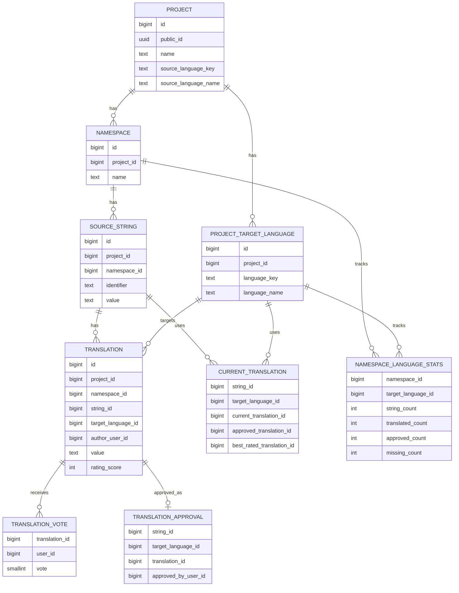

# ERD

This is the rough database shape for Fosslate.

The main hierarchy is:

```text
Project -> Namespace -> String -> Translation
```

Some tables are the real source of truth. Others exist to make the app fast when there are a lot of strings.



## projects

A project is the top-level thing.

It is where all the translation work for one app/site/thing lives.

It stores things like:

- the project name
- the project icon, if the user uploaded one
- the source language

If there is no uploaded icon, the frontend can generate one from the project UUID.

## project_target_languages

These are the languages a project wants translations for.

A language is just:

- a name
- a key

The key can be a normal BCP 47 key like `en-GB`, or a custom string if someone needs that.

Languages do not need to exist globally in the database. If a language is not used by a project, it does not need a row.

## namespaces

A namespace is a group of strings inside a project.

For example, a project could have namespaces like:

- `common`
- `auth`
- `settings`

Namespaces can be created, edited, and deleted in the UI.

A string ID only needs to be unique inside its namespace.

## source_strings

A source string is the original string that needs translating.

It stores:

- the namespace it belongs to
- the string ID
- the original value

Example:

```text
ID: login.button
Value: Log in
```

The string ID is the stable key. The value is the actual text shown to users.

## translations

A translation is someone's translated value for a source string.

It stores:

- the source string it belongs to
- the target language
- the translated value
- the user who wrote it
- the current rating score

A source string can have many translations for the same language.

For example, the same English string could have multiple French suggestions.

Translations should mostly be treated as fixed once people have voted on them. If the text changes later, it is usually cleaner to create a new translation instead of changing the old one.

## translation_votes

A vote is a user's rating on a translation.

It stores:

- the translation being voted on
- the user who voted
- the vote value

The vote value is usually:

```text
1 = upvote
-1 = downvote
```

The total score is cached on the translation so the app does not need to count all votes every time it loads a page.

## translation_approvals

An approval says which translation has been accepted for a string and language.

This is separate from `translations` because approval is not really part of the translation itself. It is the project's current decision for that string/language pair.

If a translation is approved, it wins even if another translation has a higher rating.

It stores:

- the source string
- the target language
- the approved translation
- the user who approved it
- when it was approved

## current_translations

This is the fast lookup table for the editor.

It answers:

```text
For this string and target language, what translation should we show?
```

The answer is:

```text
approved translation, if there is one
otherwise the best-rated translation
otherwise nothing yet
```

This table is not the original source of truth. It is a shortcut so namespace pages can load quickly with lots of strings.

It should be sparse, meaning it only needs rows where there is at least one translation or approval. Missing translations do not need rows here.

## namespace_language_stats

This table stores counts for a namespace and target language.

It can track things like:

- how many strings exist
- how many have translations
- how many are approved
- how many are missing
- how many candidate translations exist

This exists because progress bars and dashboard counts can get expensive if they have to count millions of rows directly.

## Basic Read Path

When loading a namespace page, the app should mostly read:

```text
source_strings -> current_translations -> translations
```

That gives the frontend the original strings plus the current translation to show.

It should not need to scan all translations and votes just to render the main editor.

## Basic Write Path

When someone adds a translation:

```text
translations gets a new row
current_translations is updated if needed
namespace_language_stats is updated
```

When someone votes:

```text
translation_votes is updated
translations.rating_score is updated
current_translations is updated if the best translation changed
```

When someone approves a translation:

```text
translation_approvals is updated
current_translations points at the approved translation
namespace_language_stats is updated
```

## Notes

- Use `BIGINT` IDs internally.
- Use UUIDs for public-facing project IDs if needed.
- Use `timestamptz` for dates.
- Use keyset pagination for large lists.
- Soft deletes should be expected for namespaces, strings, and translations.
- Deleted namespaces and strings should not block recreating the same names or IDs later.
